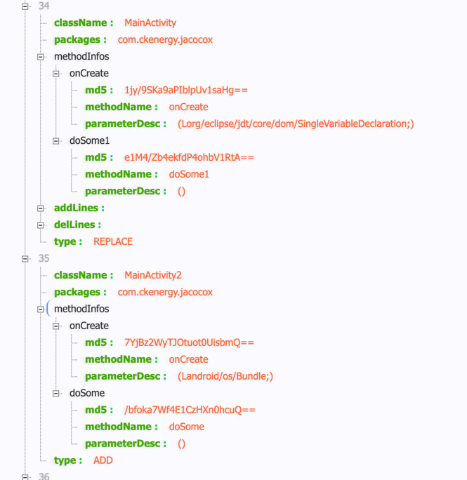

## JacocoX Android增量代码覆盖率插件的实现原理

之前已经说到过[如何使用JacocoX](README-CN.md)，接下来说下它的原理，大概分为以下几个步骤

1、[根据git diff获取增量数据](#使用git-diff获取增量数据)

2、[解析增量数据里的类名和方法名](#解析增量数据里的类名和方法名)

3、[在插桩和生成报告时过滤增量的方法](#在插桩和生成报告时过滤增量的方法)

4、[处理多进程报告和定义好自动化脚本](#处理多进程报告和定义好自动化脚本)

## 使用git diff获取增量数据

这里使用的是jGit这个框架，根据它的api可以对比不同分支直接的差异，代码来源[diff-jacoco](https://github.com/fang-yan-peng/diff-jacoco)，对部分做了修改
```kotlin
val localMasterRef = gitAdapter.repository!!.exactRef(REF_HEADS + oldBranchName11)
//  更新本地分支
gitAdapter.checkOutAndPull(localMasterRef, oldBranchName11)
val oldTreeParser = gitAdapter.prepareTreeParser(localMasterRef)

val diffCommand = git.diff().setOldTree(oldTreeParser)
//默认用当前分支的最新代码，这里会包括未提交到git的代码
if (!newBranchName.isNullOrBlank()){
    gitAdapter.checkOutAndPull(localBranchRef, newBranchName)
    //  获取分支信息
    val newTreeParser = gitAdapter.prepareTreeParser(localBranchRef)
    diffCommand.setNewTree(newTreeParser)
}
//  对比差异
val diffs = diffCommand.setShowNameAndStatusOnly(true).call()
```
相同分支的不同版本对比
```kotlin
val previousHead = repo.resolve("$oldTag^{tree}")
// Instanciate a reader to read the data from the Git database
val reader = repo.newObjectReader()
// Create the tree iterator for each commit
val oldTreeIter = CanonicalTreeParser()
oldTreeIter.reset(reader, previousHead)

val diffCommand = git!!.diff().setOldTree(oldTreeIter)
//如果没有最新的newTag，默认用当前的代码，这里会包括未提交到git的代码
if (!newTag.isNullOrBlank()) {
    val head = repo.resolve("$newTag^{tree}")
    val newTreeIter = CanonicalTreeParser()
    newTreeIter.reset(reader, head)
    diffCommand.setNewTree(newTreeIter)
}
//  对比差异
val diffs = diffCommand.setShowNameAndStatusOnly(true).call()
```
这样我们就会得到List\<DiffEntry>，里面会包含修改的文件和行数及内容，接下来就要根据这里的数据获取类名和方法名了</p>

## 解析增量数据里的类名和方法名

我们想要知道一个java或者kotlin的某一行属于哪个方法，我们首先要把这个文件解析成抽象语法树，简单来说就是获取一个文件的方法和变量等一些信息，
这里我们会用到解析java的 **ASTGenerator** (代码来源[diff-jacoco](https://github.com/fang-yan-peng/diff-jacoco))和解析kotlin的 **KotlinASTGenerator** (代码来源[kastree](https://github.com/cretz/kastree))
```kotlin
private fun fillKotlinMethodInfos(
        methodInfoList: MutableList<MethodInfo>,
        newAstGenerator: KotlinASTGenerator,
        newMethods: List<Node.Decl.Func>,
        methodsMap: Map<String, Node.Decl.Func?>,
        oldContent: String,
        newContent: String
    ) {
        for (method in newMethods) {
            // 如果方法名是新增的,则直接将方法加入List
            if (!KotlinASTGenerator.isMethodExist(method, methodsMap)) {
                val methodInfo = newAstGenerator.getMethodInfo(method)
                methodInfoList.add(methodInfo)
                continue
            }

            // 如果两个版本都有这个方法,则根据MD5判断方法是否一致
            val odlMethod = methodsMap[method.name.toString() + method.params.toString()]!!

            if (!KotlinASTGenerator.isMethodTheSame(
                    method,
                    odlMethod
                )
            ) {
                val methodInfo = newAstGenerator.getMethodInfo(method)
                methodInfoList.add(methodInfo)
            }
        }
    }
```
假设我们获取到了**MainActivity**两个版本之前的Diff数据，我们根据它修改的行数知道了修改的方法，然后我们就可以把这些数据记录下来，大概像这个图这样



## 在插桩和生成报告时过滤增量的方法

jacoco主要使用的是ASM进行插桩，它会在这个类**ClassProbesAdapter**的**visitMethod**进行处理，所以我们在这里过滤增量方法，我使用的jacoco版本为0.8.4
```kotlin
val match = DiffManager.INSTANCE?.needHackMethod(name, className) ?: false
log?.d("JacocoXClassProbesAdapter", "class:$className#$name, match:$match")
if (!match || this.name!!.startsWith("org/jacoco")) {
    return orginCv?.visitMethod(access, name, desc, signature, exceptions) ?: EMPTY_METHOD_PROBES_VISITOR
}
val methodProbes: MethodProbesVisitor
val mv: MethodProbesVisitor? = classProbesVisitor?.visitMethod(
    access, name, desc,
    signature, exceptions
)
```
然后把我们自定义的ClassProbesAdapter挂载到Transform里，这样插桩就完成了

在运行APP和完成自测后，我们需要把代码执行过的数据保存到本地
```kotlin
/**
     * 生成ec文件
     *
     * @param isNew 是否重新创建ec文件
     */
    fun generateEcFile(isNew: Boolean, context: Context) {
        var out: OutputStream? = null
        val coveragePath = context.externalCacheDir!!.path + "/coverage/"+ processName+".ec"
        val mCoverageFilePath = File(coveragePath)
        try {
            mCoverageFilePath.parentFile?.let {
                if (!it.exists()) {
                    it.mkdirs()
                }
            }
            if (isNew && mCoverageFilePath.exists()) {
                Log.d(TAG, "清除旧的ec文件")
                mCoverageFilePath.delete()
            }
            if (!mCoverageFilePath.exists()) {
                mCoverageFilePath.createNewFile()
            }
            out = FileOutputStream(mCoverageFilePath.path, true)
            val agent = Class.forName("org.jacoco.agent.rt.RT")
                .getMethod("getAgent")
                .invoke(null)
            if (agent != null) {
                out.write(
                    agent.javaClass.getMethod("getExecutionData", Boolean::class.javaPrimitiveType)
                        .invoke(agent, false) as ByteArray
                )
            }
        } catch (e: Exception) {
            e.printStackTrace()
        } finally {
            try {
                out?.close()
            } catch (e: IOException) {
                e.printStackTrace()
            }
        }
    }
```
最后我们需要把生成的数据转化成盒代码关联的html的报告，需要定义一个这样的task，运行就会生成报告
```groovy
task jacocoTestReport(type: JacocoReport) {
    reports {
        xml.enabled = false
        html.enabled = true
        html.outputLocation = file("$buildDir/$reportFile")
    }
    ....
}
```
这个task会经过**JacocoReport**，最终会执行一个已经定义好的**ReportTask**，这样用的是groovy的元编程
```java
protected void configureAntReportTask(FileCollection classpath, final Action<GroovyObjectSupport> action) {
    this.ant.withClasspath(classpath).execute(new Closure<Object>(this, this) {
        public Object doCall(Object it) {
            GroovyObjectSupport antBuilder = (GroovyObjectSupport)it;
            antBuilder.invokeMethod("taskdef", ImmutableMap.of("name", "jacocoReport", "classname", "org.jacoco.ant.ReportTask"));
            action.execute(antBuilder);
            return null;
        }
    });
}
```
然后在**ReportTask**回调用**Analyzer**，然后就会调用**ClassProbesAdapter**，所以我们需要把这些替换成我们自定义的类，
具体可查看**baseJacoco.gradle**里的**jacocoTestReport** task，这样在生成报告的时候也会过滤增量的方法

## 处理多进程报告和定义好自动化脚本

1、Android gradle自带的jacoco在生成报告时需要配置**class**和**源码**的路径，当我们有很多个module和多渠道针对不同的**buildType、flavor**有不同的代码时就会有点复杂和麻烦，
这里我会在打包的时候获取当前打包的buildType和flavor然后保存到本地文件，在生成报告的时候读取，具体可看**baseJacoco.gradle**里的**getClassAndSource**

2、在生成报告的时候，我们可以通过命令行发生一条自定义广播给APP，APP接收到广播后把内存里覆盖率数据保存到本地，然后我们再通过adb pull出来，这里我们也可以通过ASM插桩把广播自动注册到APP内

3、假如APP是多进程的就要生成多份数据，因为每个进程都有单独的内存区域，然后我们用jacoco的**MergeTask**把多份数据合并成一份

最后的自定义脚本大概这样，在工程下的**jacocoreport**
```shell
adb shell am broadcast -a jacocox.generate.com.ckenergy.jacocox
sleep 0.5
./gradlew jacocoInit
adb pull /storage/emulated/0/Android/data/com.ckenergy.jacocox/cache/coverage/ ./app/build/outputs/code-coverage
./gradlew jacocoTestMerge
./gradlew jacocoTestReport
open ./app/build/reports/jacoco/jacocoTestReport/html/index.html
```


参考：

[简单两步实现 Jacoco+Android 代码覆盖率的接入!](https://cloud.tencent.com/developer/article/1864006)

[diff-jacoco](https://github.com/fang-yan-peng/diff-jacoco)

[kastree](https://github.com/cretz/kastree)

[Merge Jacoco coverage reports for multiproject setups](https://discuss.gradle.org/t/merge-jacoco-coverage-reports-for-multiproject-setups/12100)

[Android增量代码测试覆盖率工具](https://tech.meituan.com/2017/06/16/android-jacoco-practace.html)


