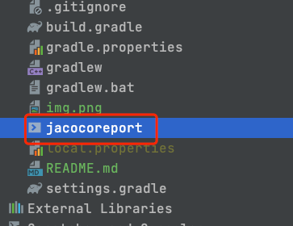

## JacocoX 是一个基于jacoco的增量代码覆盖率工具

### 如何使用

#### 1、在工程目录的 build.gradle添加

```groovy
    classpath 'io.github.ckenergy:jacocox-plugin:1.0.2'
```
#### 2、 baseJacoco.gradle 、 jacoco.gradle 将这两个文件添加到app目录下

like：


#### 3、在 app build.gradle 添加
```groovy
apply from: 'jacoco.gradle'
```
#### 4、添加 jacocoreport 到工程目录

like：



#### 5、添加 git compareBranch 或 compareTag，只能添加一个，都有的情况下compareBranch优先级更高，如果都没写，默认对比master或main分支
```groovy
jacocoX {
    //    compareBranch = "master"
    compareTag = "****"
    infoFile = jacocoInfoFile
    printLog = true
    enable = true
}
```

#### 6、将jacocoreport文件内的文字替换你项目的applicationId 


#### 然后就可以运行你的项目和测试了, 测试完毕后输入在命令行输入./jacocoreport , 就会生成报告
