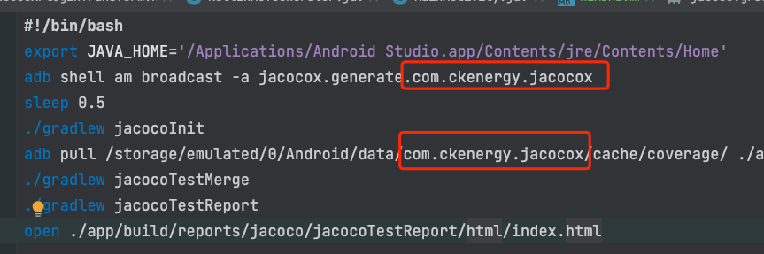
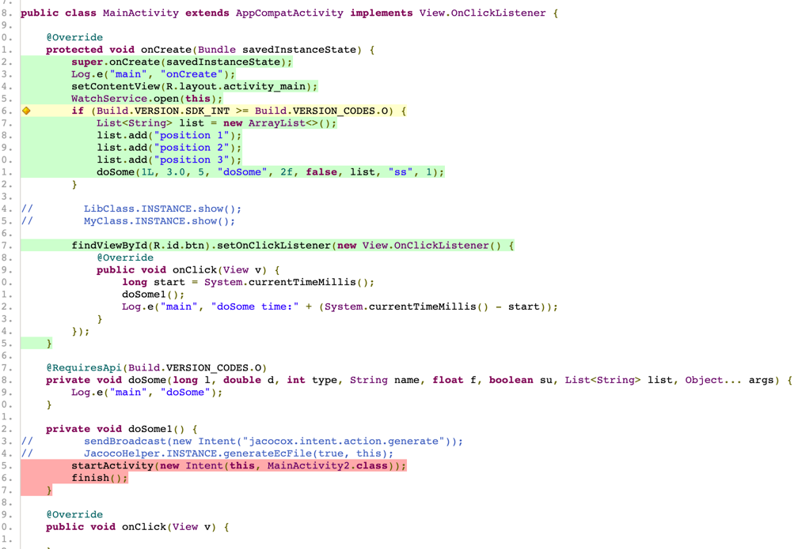

## jacocox is an Android incremental code coverage plugin

[文档还是中文的好](README-CN.md)

### How to use(version=1.0.9)

#### 1、root build.gradle

```groovy
    classpath 'io.github.ckenergy:jacocox-plugin:$version'
```
#### 2、add file **jacocoX.gradle** in root dir

#### 3、root build.gradle
```groovy
subprojects {
    apply from: "$rootProject.projectDir/jacocoX.gradle"
}
```
#### 4、add file **jacocoreport** into root dir

like：


#### 5、add git **compareBranch** or **compareTag**，if them all empty, default compareBranch is master or main
```groovy
jacocoX {
    //    compareBranch = "master"
    compareTag = "****"
    printLog = true
    enable = true
}
```

#### 6、replace with your **applicationId** in **jacocoreport**



#### next you can run you app and testing, in Terminal input **./jacocoreport** when you are finish test, then it will open a report in your browser



